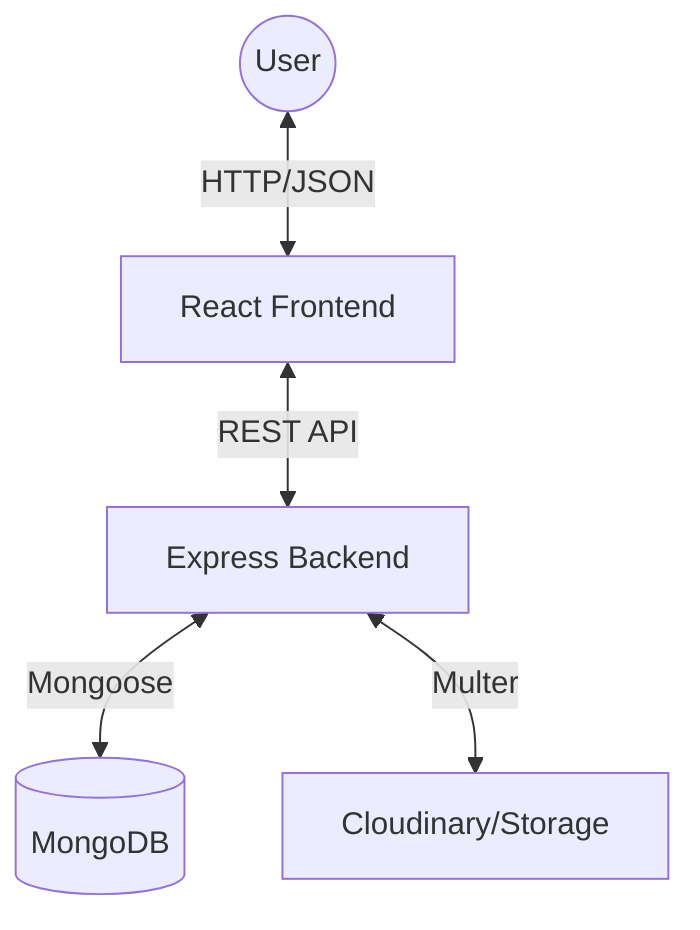

# Project Architecture - Real Estate CRM

This document provides a high-level overview of the technical architecture and data flow within the Real Estate CRM application.

## System Overview

The application follows the **MERN** stack architecture (MongoDB, Express, React, Node.js), which is a common and robust pattern for modern web applications.

## Backend Architecture

The backend is built as a RESTful API using Node.js and Express. It is organized into a modular structure:

- **`models/`**: Defines the data schema using Mongoose. These represent the core entities: Users, Leads, Properties, Deals, Tasks, etc.
- **`controllers/`**: Contains the business logic for each route. It handles data processing and interacts with the models.
- **`routes/`**: Defines the API endpoints and maps them to the appropriate controller functions.
- **`middleware/`**: Functions that run during the request-response cycle, such as authentication (`auth.js`) and error handling.
- **`config/`**: Configuration files for database connections and environment variables.

### Data Flow (Backend)
1. **Request**: A client sends an HTTP request to an endpoint.
2. **Routing**: Express maps the request to a specific route.
3. **Middleware**: Authentication middleware verifies the JWT token.
4. **Controller**: The controller receives the request, interacts with the relevant model.
5. **Model**: Mongoose performs CRUD operations on MongoDB.
6. **Response**: The controller formats the data and sends a JSON response back to the client.

## Frontend Architecture

The frontend is a single-page application (SPA) built with React and Vite.

- **`pages/`**: Represents high-level views (Dashboard, Leads, Properties, etc.) that correspond to routes.
- **`components/`**: Reusable UI elements ranging from simple buttons to complex modals and Kanban boards.
- **`context/`**: Uses React Context API for global state management (e.g., Authentication state).
- **`hooks/`**: Custom React hooks for encapsulating common logic and API calls.
- **`services/`**: Modules for making API calls to the backend.

### UI/UX Design

The application features a "Premium Luxury" aesthetic, characterized by:
- **Color Palette**: Sophisticated blacks, whites, and gold accents.
- **Typography**: Modern fonts (e.g., "Plus Jakarta Sans").
- **Components**: Glassmorphism effects, subtle gradients, and smooth animations using Tailwind CSS.

## Key Technologies

| Category | Technology | Purpose |
| :--- | :--- | :--- |
| **Database** | MongoDB | NoSQL database for flexible document storage. |
| **Backend** | Express | Lightweight web framework for Node.js. |
| **Frontend** | React | Component-based UI library for build speed and reuse. |
| **Styling** | Tailwind CSS | Utility-first CSS framework for rapid UI development. |
| **Auth** | JWT | Secure, stateless authentication via JSON Web Tokens. |
| **Charts** | Recharts | Data visualization for dashboard metrics. |
| **Uploads** | Multer | Handling multipart/form-data for file uploads. |

---

For detailed API documentation, please refer to [API_REFERENCE.md](./docs/API_REFERENCE.md).
